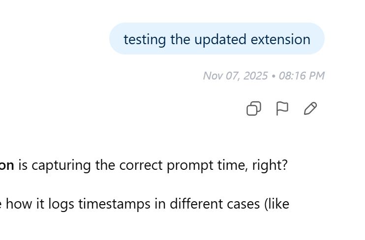
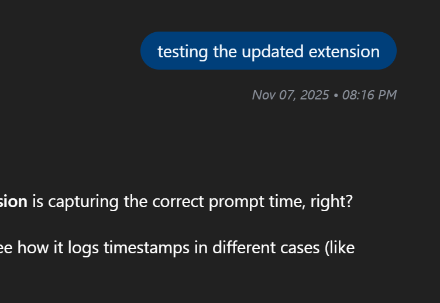
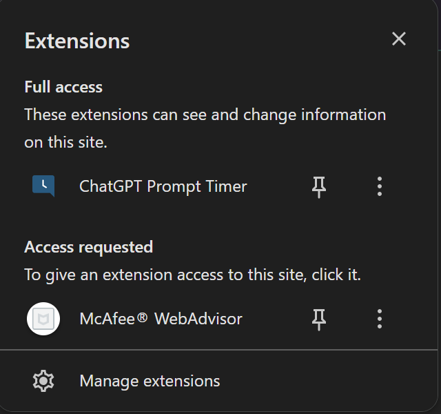
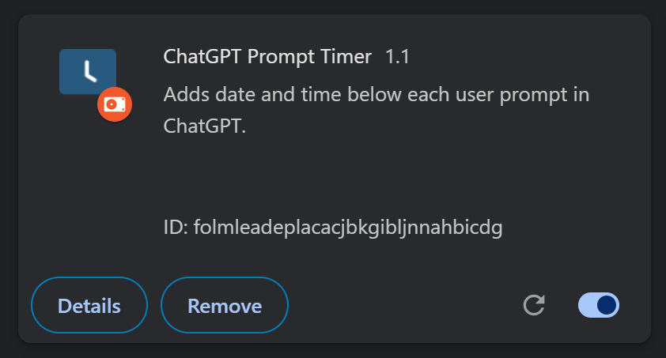

# ChatGPT Prompt Timer

A lightweight Chrome extension that **displays the date and time below each user prompt** in ChatGPT — fixing a small but noticeable UX gap.

It seamlessly integrates into the ChatGPT interface (both light and dark mode) and adds a subtle timestamp after every message you send.

---

## Features

- **Automatic Timestamp Injection**  
  Adds the exact date and time beneath every user message instantly after sending.

- **Clean & Minimal Styling**  
  Matches ChatGPT’s native design in both light and dark mode for a cohesive experience.

- **Fully Local and Secure**  
  No data is collected or transmitted — everything runs inside your browser.

- **Auto-Updating DOM Observer**  
  Detects new messages dynamically using Chrome’s `MutationObserver`.

---

## Screenshots

| Light Mode | Dark Mode |
|-------------|------------|
|  |  |

### Chrome Extension View
| Toolbar Icon | Extension List |
|---------------|----------------|
|  |  |

---

## Installation (Manual)

You can install and test it locally in just a few steps:

1. **Clone the repository**
   ```bash
   git clone https://github.com/BhriguKD/Chatgpt_Prompt_Timer.git
2. **Open Chrome extension page**
   ```
   chrome://extensions/
3. **Enable Developer Mode** (toggle in the top-right corner)
4. Click “Load unpacked” & Select your project folder:
    ```
   `Chatgpt_Prompt_Timer
    ```
5. Open ChatGPT | Enter Prompt | See the magic

## Folder Structure
```
Chatgpt_Prompt_Timer/
│
├── manifest.json          # Chrome extension config
├── content.js             # Core logic: detects messages & injects timestamps
├── style.css              # Custom styling for timestamps
├── icons/                 # Extension icons (16px, 48px, 128px)
└── assets/                # Screenshots for README (optional)
```

## About
  - Developer: Bhrigu KD (DexTer)
  - Project Type: Mini UX Chrome Extension
  - Goal: Improve ChatGPT’s user experience by adding subtle, helpful context for each message.
